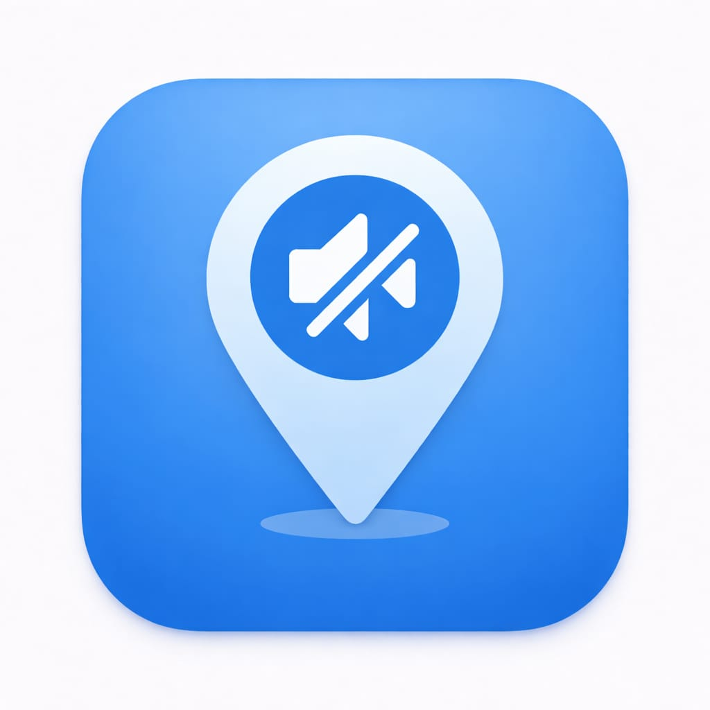

# 📍 GeoMute

<p align="center">
  
</p>

<p align="center">
  <b>A Smart Geolocation-Based Silent Mode Application</b><br/>
  Automatically switches your phone to silent mode when entering specific locations
</p>

<p align="center">
  
  
  
  
  
</p>

---

## 📖 About

**GeoMute** is a Flutter-based Android application that uses GPS geofencing to automatically manage your phone's sound profile. When you enter a defined silent zone (college, office, library, hospital), the phone silences itself — and restores to normal when you leave.

No more embarrassing ringtones in class or meetings!

---

## ✨ Features

- 🔇 **Automatic Sound Control** — Switches between Silent, Vibrate, and Normal modes
- 📍 **Multiple Silent Zones** — Create unlimited custom geofenced areas
- 🗺️ **Google Maps Integration** — Visually select zones on an interactive map
- 🔄 **Background Monitoring** — Monitors location even when app is closed (every 15 min)
- ⚡ **Foreground Monitoring** — Real-time checks every 5 seconds when app is open
- 💾 **Local Storage** — All zones saved locally, works offline
- 🎨 **Material Design UI** — Clean, modern interface with gradient app bar
- 🔍 **Location Search** — Search any address to set as a zone

---

## 📱 Screenshots

> Add screenshots here after running the app

| Home Screen | Map Screen | Zone List |
|-------------|------------|-----------|
|  |  |  |

---

## 🚀 Getting Started

### Prerequisites

- Flutter SDK 3.0+
- Android Studio
- Android device or emulator (Android 8.0+)

### Installation

```bash
# Clone the repository
git clone https://github.com/Ritesh106-web/Geomute.git

# Navigate to project
cd Geomute

# Install dependencies
flutter pub get

# Run the app
flutter run
```

### Build APK

```bash
flutter build apk --release
```

APK will be at: `build/app/outputs/flutter-apk/app-release.apk`

---

## 🔧 Configuration

### Google Maps API Key

Replace the API key in `android/app/src/main/AndroidManifest.xml`:

```xml
<meta-data
  android:name="com.google.android.geo.API_KEY"
  android:value="YOUR_GOOGLE_MAPS_API_KEY"/>
```

Get your API key from [Google Cloud Console](https://console.cloud.google.com/).

### Required Permissions

The app requires the following Android permissions:

| Permission | Purpose |
|------------|---------|
| ACCESS_FINE_LOCATION | GPS tracking |
| ACCESS_BACKGROUND_LOCATION | Background monitoring |
| MODIFY_AUDIO_SETTINGS | Sound mode control |
| ACCESS_NOTIFICATION_POLICY | Do Not Disturb access |

---

## 🏗️ Project Structure

```
geomute/
├── lib/
│   ├── main.dart                  # App entry point
│   ├── models/
│   │   └── silent_zone.dart       # Zone data model
│   ├── screens/
│   │   ├── home_screen.dart       # Main dashboard
│   │   ├── map_screen.dart        # Zone selection map
│   │   └── about_screen.dart      # About page
│   └── services/
│       ├── location_service.dart  # GPS & geofencing
│       ├── sound_service.dart     # Sound control
│       └── storage_service.dart   # Local persistence
├── android/
│   └── app/src/main/kotlin/
│       ├── MainActivity.kt        # Native sound control
│       └── LocationWorker.kt      # Background WorkManager
└── pubspec.yaml
```

---

## 🛠️ Technologies Used

| Technology | Purpose |
|------------|---------|
| Flutter 3.x | Cross-platform UI framework |
| Dart | Programming language |
| Kotlin | Native Android integration |
| Google Maps Flutter | Map visualization |
| Geolocator | GPS & distance calculation |
| SharedPreferences | Local data storage |
| Android WorkManager | Background task scheduling |
| Android AudioManager | Sound profile control |

---

## 📦 Dependencies

```yaml
dependencies:
  geolocator: ^10.1.0
  google_maps_flutter: ^2.5.0
  shared_preferences: ^2.2.2
  permission_handler: ^11.0.1
  sound_mode: ^3.1.1
  geocoding: ^2.1.1
```

---

## 🤝 Contributing

Contributions are welcome! Please read [CONTRIBUTING.md](CONTRIBUTING.md) for details.

1. Fork the repository
2. Create your feature branch (`git checkout -b feature/AmazingFeature`)
3. Commit your changes (`git commit -m 'Add AmazingFeature'`)
4. Push to the branch (`git push origin feature/AmazingFeature`)
5. Open a Pull Request

---

## 📄 License

This project is licensed under the MIT License - see the [LICENSE](LICENSE) file for details.

---

## 📬 Contact

**Ritesh Kumar**

- 📧 Email: [riteshkumar123hi@gmail.com](mailto:riteshkumar123hi@gmail.com)
- 🐙 GitHub: [@Ritesh106-web](https://github.com/Ritesh106-web)
- 🏫 Institution: Cambridge Institute of Technology, Bengaluru

---

## 🙏 Acknowledgements

- [Flutter](https://flutter.dev/) - UI Framework
- [Google Maps Platform](https://developers.google.com/maps) - Maps API
- [pub.dev](https://pub.dev/) - Flutter packages

---

<p align="center">Made with ❤️ by Ritesh Kumar</p>
